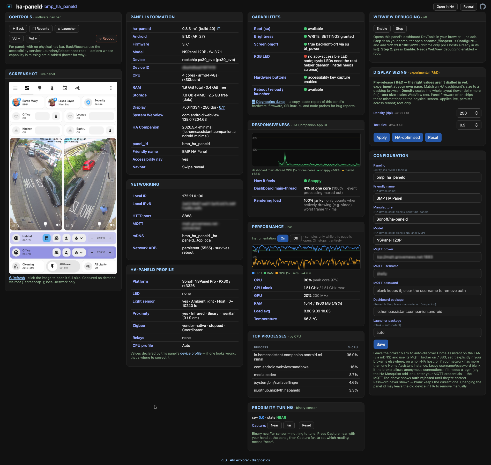
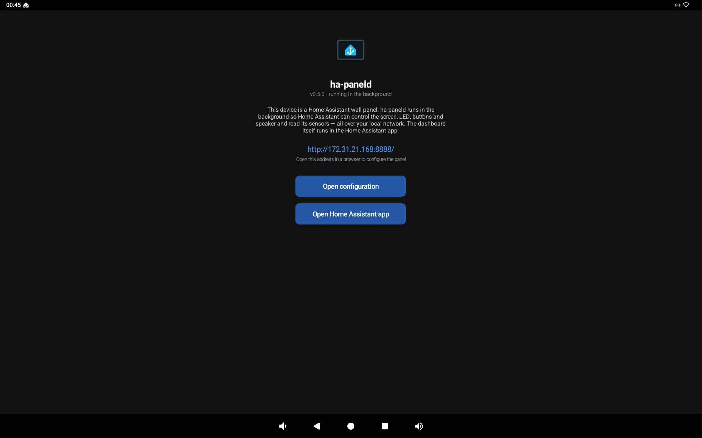
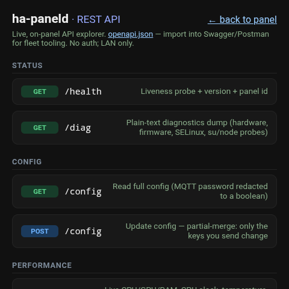

<picture>
  <source media="(prefers-color-scheme: dark)" srcset="app/src/main/res/drawable-night-nodpi/wordmark.png">
  
</picture>

[](https://github.com/maxlyth/ha-paneld/actions/workflows/ci.yml)
[](https://github.com/maxlyth/ha-paneld/releases/latest)
[](LICENSE)

**ha-paneld is free, open-source, and exists to fix what's wrong with Home Assistant wall panels** —
the per-vendor fragmentation, the sluggish dashboards, and the clunky manufacturer software you're
otherwise stuck with. It gives one consistent, Home-Assistant-first integration for the
LEDs, buttons, sensors, screen and TTS across panels from *different* makers, plus the tooling to make a
dashboard actually feel fast on cheap hardware.

It's a small Android agent that exposes panel-side hardware to Home Assistant over HTTP + MQTT
auto-discovery + mDNS, so a panel pairs itself with HA when you sideload the APK — no per-device YAML.

It is built for panel-class Android (Sonoff NSPanelPro, Tuya TPA10, and similar), **not** personal
phones. The official [HA Companion app](https://github.com/home-assistant/android) remains the HOME
launcher and dashboard; ha-paneld runs as a headless foreground service alongside it and never takes
the foreground.



**Performance is a first-class concern.** Panel-class hardware is cheap and frequently underpowered,
so a Home Assistant dashboard that flies on a phone can crawl on a wall panel — and there's usually
no visibility into *why*. A large part of ha-paneld is therefore about **measuring and tuning**: it
reports on-device CPU / GPU / clock and thermal throttling, a dashboard responsiveness metric, the
top CPU consumers, and a 1-click WebView DevTools relay — so you can find what's actually costing
frames and tune the dashboard to the panel instead of guessing. See the
[performance comparison](docs/hardware/README.md#performance-comparison--practical-deployment) and
[docs/performance.md](docs/performance.md).

> [!NOTE]
> **v0.x preview** — entity names and the API may still change before v1.0.0. It's an ordinary app
> install (no root-partition or firmware changes), so it uninstalls cleanly if you change your mind.

## Install

First enable network ADB on the panel (Developer options → "ADB debugging"). Then, from any machine
with `adb` on the same LAN, paste:

```sh
curl -fsSL https://raw.githubusercontent.com/maxlyth/ha-paneld/main/scripts/install.sh | bash
```

No checkout, no parameters: it checks your tools (with fix-it hints if `adb`/`curl` are missing),
prompts for the panel IP (and optional id / MQTT broker), downloads the **latest signed release**, and
provisions the panel. For scripted/fleet installs use [`scripts/provision.sh`](scripts/provision.sh)
directly (see [Provisioning](#provisioning-no-device-ui-on-rooteduserdebug-panels)).

> [!NOTE]
> ha-paneld is the headless agent — your dashboard launcher is the
> [HA Companion app](https://github.com/home-assistant/android). On panels without Google Play, install
> its [**minimal** release APK](https://github.com/home-assistant/android/releases/latest/download/app-minimal-release.apk)
> (the no-Google-Play build).

### Other ways to install

The one-liner uses **network adb**. If a panel doesn't expose adb over the network:

- **Bootstrap via USB (Tuya TPA10 / Smatek panels).** adb — and `adb root` — is often only available,
  or only rooted, on the **USB port**. Plug in, enable network adb, then install as normal:

  ```sh
  adb devices                   # accept the on-screen RSA prompt if shown
  adb root                      # if supported (needed for the sysfs-LED helper daemon)
  adb tcpip 5555                # expose adb on the network (resets on reboot)
  adb connect <panel-ip>:5555
  ```

  then run the one-liner (or `scripts/provision.sh <panel-ip:5555>`).
- **No adb at all.** With a browser or file manager on the panel, download the
  [release APK](https://github.com/maxlyth/ha-paneld/releases/latest), enable "install unknown apps"
  and tap to install — then **grant permissions by hand** (Settings → Apps → ha-paneld → *Modify
  system settings*; Accessibility → enable the service), which the app's setup screen guides. Not
  possible on locked-down panels with no browser/file manager.

> [!NOTE]
> ha-paneld can only be sideloaded on a panel — it isn't on the Play Store (its accessibility use for
> buttons/nav doesn't fit Play policy), so even Play-capable panels (eg 2026 Android 14 models) should sideload it.

> [!IMPORTANT]
> **First-run gotcha — update the panel's system WebView.** Even modern panels ship with a
> WebView/Chromium far too old to render a current Home Assistant dashboard, so the HA Companion app
> might show a blank or broken UI. Fix it cleanly over adb — **no F-Droid or third-party app store needed**:
> see [Updating the system WebView](docs/hardware/README.md#updating-the-system-webview). This trips up
> almost everyone; do it before judging anything else.

## Why not just the Home Assistant Companion app?

The [HA Companion app](https://github.com/home-assistant/android) targets personal phones and tablets. Wall panels need different primitives: arbitrary-URL
audio announcements, screen/LED/button control,
hardware-button events back to HA, and turnkey mDNS pairing. ha-paneld covers those; Companion keeps
doing what it does (and remains the dashboard host).

## Why not Fully Kiosk?

[Fully Kiosk Browser](https://www.fully-kiosk.com/) is the usual answer for HA wall panels, and it's
genuinely capable. But it sits awkwardly against Home Assistant's own values, and on a small mixed
fleet its wins are narrow for the friction it adds:

- **Not free, not open source.** Fully Kiosk is closed-source commercial software. The free tier is
  limited and nags; the parts people actually want for a panel — the remote-admin REST/MQTT API,
  motion/screensaver controls, no watermark — need the paid **Plus** licence, **per device**. That
  cuts against HA's free, open, local-first ethos; ha-paneld is Apache-2.0 and the dashboard runs in
  the official, open Companion app.
- **The Companion app already serves dashboards better.** For day-to-day dashboard rendering, the
  Companion app is purpose-built for HA — native auth and sessions, push notifications, deep links,
  and it tracks the frontend. A general-purpose kiosk browser is a second rendering path to keep
  working; ha-paneld deliberately leaves dashboard hosting to HA Companion and only adds the panel
  hardware HA can't otherwise reach.
- **Per-device config doesn't scale on a non-homogeneous fleet.** Fully Kiosk is configured per
  device (its settings UI / per-device cloud), so a mixed fleet of different panels drifts and each
  unit is a bespoke setup. ha-paneld is config-as-code: MQTT auto-discovery, uniform entities across
  every panel, and one `update-fleet.sh` to roll them together.

If Fully Kiosk's specific extras (e.g. its kiosk lockdown or its particular screensaver) are
load-bearing for you, keep using it — ha-paneld doesn't try to replace a browser. It replaces the
*panel-hardware* gap, openly, without a per-device licence.

## Capabilities

| Cap | Surface |
|-----|---------|
| TTS / announce audio | `POST /play` + `number.<panel>_volume` (HA has no MQTT media_player platform) — server-side TTS recipe in [docs/tts.md](docs/tts.md) |
| Screen brightness | `light.<panel>_screen` brightness |
| Screen on/off (true backlight off, no lock/PIN) | `light.<panel>_screen` on/off |
| RGB LED | `light.<panel>_led` (per-panel HAL: rk3576 NDK `/dev/ledjni`, or sysfs via the root helper) |
| URL navigate | `text.<panel>_navigate` |
| Hardware-button events | `event.<panel>_button` (a11y key capture) |
| Ambient light / proximity | `sensor.<panel>_illuminance`, `binary_sensor.<panel>_proximity` |
| Reload dashboard / reboot | `button.<panel>_reload`, `button.<panel>_reboot` |
| Launcher / Home Assistant (bring a launcher or the HA dashboard forward) | `button.<panel>_launcher`, `button.<panel>_home` |
| Panel info + config web page | `GET /` (the device "Visit" link) |

## The control API — uniform MQTT entities

Every panel publishes the **same** Home Assistant MQTT-discovery entities, regardless of underlying
hardware (the per-panel HAL is hidden behind them). Configure an MQTT broker and they appear with
no YAML:

| Entity | Capability | Notes |
|--------|------------|-------|
| `light.<panel>_screen` | brightness + on/off | on = backlight on, off = true backlight-off (no keyguard/PIN); JSON schema, brightness 0–255 |
| `light.<panel>_led` | RGB | published only when a LED backend is present (NDK `/dev/ledjni` or the root helper) |
| `text.<panel>_navigate` | push a URL to the panel | depends on Companion intent handling; last URL restored on reconnect |
| `event.<panel>_button` | hardware button presses | published only when the a11y key-filter is enabled |
| `number.<panel>_volume` | TTS/announce volume | 0–100% → `STREAM_MUSIC`; playback is the HTTP `/play` contract below |
| `sensor.<panel>_illuminance` | ambient lux | standard `SensorManager` `TYPE_LIGHT`; published only if present |
| `binary_sensor.<panel>_proximity` | proximity (occupancy) | standard `SensorManager` `TYPE_PROXIMITY`; published only if present |
| `button.<panel>_reload` | reload dashboard | force-stop + relaunch the configured dashboard package (root helper, else `su`) |
| `button.<panel>_reboot` | reboot panel | root helper, else `su` |
| `button.<panel>_launcher` | bring a launcher to the foreground | fires `CATEGORY_HOME` at a non-default launcher (or configured `launcher_package`), leaving the boot/default home app unchanged |
| `button.<panel>_home` | bring the HA dashboard to the foreground | launches `dashboard_package` if set, else the default home app (the HA Companion) — the complement of the Launcher button |

The device's display name (`configuration_url` "Visit" link, friendly name) and the LED/screen
states are re-published on every (re)connect, and the MQTT client auto-reconnects, so HA stays in
sync after a panel reboot or broker blip.

## HTTP contract

```text
GET  /              panel info + config page (versions, hardware, status; panel_id,
                    friendly name, MQTT broker/creds, dashboard package). This is the
                    device's configuration_url, so HA shows a "Visit" link.
GET  /api           interactive REST API explorer (renders the OpenAPI spec)
GET  /openapi.json  OpenAPI 3 spec of this API (import into Swagger / Postman)
POST /config        form-encoded settings from the page; persists + live-reconfigures
GET  /config        full config as JSON (MQTT password redacted) for fleet tooling
GET  /perf          live performance JSON (CPU %/clock, GPU, RAM, temp, top procs,
                    responsiveness) — polled by the page; sampled only while viewed
POST /instrumentation   enabled=true|false — turn the perf sampler on/off
GET  /proximity     live proximity raw + calibration (raw stays on the panel)
POST /proximity/{capture,threshold,sensitivity,reset}   tune the cutoff
GET  /inspect · POST /inspect/{start,stop}              WebView DevTools relay (:9222)
GET  /diag          copy-paste diagnostics dump (build, SELinux, su probe, /dev +
                    /sys node listings, packages, capability assessment)
GET  /health        -> 200 "ha-paneld <version> panel=<id>"
POST /play          body contains an audio URL (raw or {"url":"…"})
                    -> 200 "playing"  (download + play happen in the background)
                    -> 400 "no-url"   (no URL found in body)
```

The web page at `/` is how a user sets the **MQTT broker** without adb — find the panel's IP (mDNS
`_ha-paneld._tcp`, or the router), open `http://<ip>:8888/`, fill in the broker + credentials, Save.

The agent listens on **:8888**. Self-signed HTTPS sources are accepted (panels live on a trusted
LAN). This is the same contract as the reference shell receiver it replaces, so HA-side automation
needs no change when a panel migrates from the shell receiver to ha-paneld.

## Pairing

The agent advertises `_ha-paneld._tcp.local.` with TXT records (`ver`, `caps`, `path`). If an MQTT
broker is configured it publishes Home Assistant MQTT-discovery configs so panel entities appear
without YAML.

**Zero-config:** with no broker set, ha-paneld browses for Home Assistant's own `_home-assistant._tcp`
advert on the LAN and uses its MQTT broker on :1883 — so a fresh install pairs itself. If the broker
needs a login (e.g. the HA Mosquitto add-on), set the username/password on the config page; the MQTT
status reads *auth rejected* until they're right. Set the broker explicitly if it's elsewhere or your
LAN has more than one Home Assistant. With nothing found, the HTTP surface still works standalone.

## Provisioning (no device UI on rooted/userdebug panels)

All permissions are granted over adb — no per-device tap-through. Run the same script on every panel:

```bash
scripts/provision.sh <panel-ip:5555> \
    [--id NAME] [--mqtt tcp://host:1883] [--latest] [--force]
```

With no `--apk` and no local build it downloads the **latest signed release** from GitHub (`--latest`
forces that even when a local build exists). It connects, installs, grants the permissions below,
starts the agent, optionally sets the panel id / MQTT, and ends with a self-verify checklist. It is
**idempotent** — re-run the same command to finish after any interruption — and warns before
reinstalling the same or an older version (`--force` skips that). `scripts/provision.sh <ip> --verify`
re-checks a panel without changing anything.

**Updating a whole fleet:** use [`scripts/update-fleet.sh`](scripts/update-fleet.sh). The fleet script downloads the release once and runs `provision.sh` per panel, so every one
is installed **and launched and verified**:

```bash
scripts/update-fleet.sh --latest -- 192.168.1.10 192.168.1.11:5555
# or pipe a host list:  printf '%s\n' 192.168.1.10 192.168.1.11 | scripts/update-fleet.sh --latest
```

Non-root panels: use the in-app setup screen, which fires the standard system permission intents.

**Permission → why:**

| Permission | For | Grant |
|------------|-----|-------|
| `POST_NOTIFICATIONS` | foreground-service notification | runtime / `pm grant` |
| `WRITE_SETTINGS` | screen brightness | `appops set <pkg> WRITE_SETTINGS allow` |
| Accessibility (key filter) | hardware-button events | `settings put secure enabled_accessibility_services …` |

Screen-off needs **no device admin** — ha-paneld powers the backlight off via the root helper daemon
or `su` (`bl_power`), falling back to brightness-0, so it never raises a keyguard/PIN and never blocks
its own uninstall. (Builds ≤ 0.5.0 shipped an optional device admin; 0.5.1 removed it — see the
signing note below if you're upgrading from one where you'd activated it.)

## RGB LED — clean-room NDK, no vendor library

On the rk3576 panel (Electron WF1589T) the front RGB LED is reached via the char device
`/dev/ledjni`, which is world-rwx and labelled app-accessible (SELinux `device` domain), so a
normal app drives it **without root or a helper**. ha-paneld ships its **own** ~70-line NDK driver
([`app/src/main/cpp/led_jni.c`](app/src/main/cpp/led_jni.c)) doing the ioctls directly. The
protocol (request numbers, value range, open flags) was reverse-engineered clean-room from a
hardware sample so **no vendor library is bundled or required**. The LED entity is published only on panels where `/dev/ledjni`
is openable.

Other panels (e.g. Tuya TPA10) expose their LED only through root-only `/sys/class/leds/*`. A
sandboxed app cannot reach those (SELinux `untrusted_app` cannot exec `su` nor write `sysfs_leds`),
so those panels need a small **root helper daemon** that ha-paneld talks to over a localhost socket.
The daemon and its boot-persistent installer live in [`helper/`](helper/) — build and install it with
[`helper/README.md`](helper/README.md).

## Supported hardware

ha-paneld needs no system-signed install. Standard-Android capabilities (brightness, sleep,
navigate, TTS) work on any panel; LED/buttons depend on a per-panel HAL.

| Panel class | SoC | Android | ABI | Notes |
|-------------|-----|---------|-----|-------|
| Sonoff NSPanelPro / Pro120 | Rockchip PX30 | 8.1 (API 27) | arm64-v8a | toolbox `su` |
| Tuya TPA10 | Rockchip rk3566 | 11 (API 30) | armeabi-v7a | 32-bit userspace |
| Electron WF1589T | Rockchip rk3576 | userdebug (`adb root`) | arm64-v8a | RGB LED via clean-room NDK ioctl on `/dev/ledjni` (no vendor lib) |

Other Android panels are welcome — contribute a HAL adapter for your hardware. Deep per-panel
hardware references (SoC, sensors, LED path, radios) are in [docs/hardware/](docs/hardware/).

**minSdk is 26.** API < 26 is unsupported (the MQTT client cannot connect below API 26).

## Build

### Option A — Docker (no toolchain, no CI access needed)

Only Docker is required. The script builds a version-pinned image (JDK 17 + Android SDK 35 + NDK +
CMake, matching CI) and runs Gradle inside it; the APK lands in your working tree.

```sh
./tools/build/build.sh                       # debug APK -> app/build/outputs/apk/debug/
./tools/build/build.sh :app:assembleRelease  # any Gradle task(s) instead
```

The image is built once and cached; Gradle caches persist in a named Docker volume, so repeat
builds are fast. See [`tools/build/`](tools/build/) (and the `HOST_WORKDIR` note in `build.sh` if
you run from inside a container talking to an outer Docker daemon).

### Option B — local toolchain

```sh
./gradlew :app:assembleDebug      # debug APK -> app/build/outputs/apk/debug/
./gradlew :app:assembleRelease    # release APK (unsigned unless signing configured)
```

Requires **JDK 17** and an Android SDK with **NDK 27.0.12077973 + CMake 3.22.1** (for the native
`/dev/ledjni` LED driver). The Gradle wrapper pins the Gradle version; nothing else needs installing.

### Toolchain note

The build is pinned to a conservative AGP 8.7 / Kotlin 2.0 / Gradle 8.10 combo for reliable
first-run CI. Newer AGP/Kotlin is fine to adopt during the v0.x line — versions live in
[`gradle/libs.versions.toml`](gradle/libs.versions.toml).

### Signing — what forkers need to know

You don't need to configure signing to build and run ha-paneld.

<details>
<summary>Signing details — dev vs official builds, the key-mismatch gotcha, legacy device-admin, signing your own fork</summary>

Two cases:

- **Dev / fork builds** are signed with the **committed `debug.keystore`** (password `android`). It's
  in the repo on purpose — not a secret — so every build (yours, mine, CI's) shares one signature.
  That's what lets `install -r` update a panel in place without uninstalling. Just build and install.
- **Official releases** are signed with a private key held in GitHub Actions secrets
  (`ANDROID_KEYSTORE_BASE64`, `ANDROID_KEYSTORE_PASSWORD`, `ANDROID_KEY_ALIAS`, `ANDROID_KEY_PASSWORD`).
  A fork won't have those, so a tagged release in your fork falls back to a **debug-signed** APK —
  fine for personal use.

> [!IMPORTANT]
> Android refuses to update an installed app with an APK signed by a **different** key. So you cannot
> install your own debug-signed build over an installed *official* (release-signed) build, or vice
> versa — `adb`/the installer rejects it with a signature mismatch. Uninstall first
> (`adb uninstall io.github.maxlyth.hapaneld`), then install the other build. Uninstalling clears the
> panel's saved config, so re-run provisioning afterwards. This is the one thing that trips people up.
>
> **Legacy device-admin (builds ≤ 0.5.0 only):** 0.5.1 removed the device admin entirely, so fresh
> installs never hit this. But if you'd activated it on an older build, uninstall fails with
> `DELETE_FAILED_DEVICE_POLICY_MANAGER` until you deactivate it — **Settings → Security → Device admin
> apps → turn off "ha-paneld"**, then `adb uninstall io.github.maxlyth.hapaneld`. (`dpm
> remove-active-admin` does *not* work — Android refuses to remove a non-test admin via the CLI.)

**Signing your own fork's releases (optional):**

```sh
keytool -genkeypair -storetype PKCS12 -keystore release.jks -alias ha-paneld \
  -keyalg RSA -keysize 2048 -validity 10000 -dname "CN=ha-paneld"
base64 -w0 release.jks   # -> the ANDROID_KEYSTORE_BASE64 repo secret
```

Use one password for both `ANDROID_KEYSTORE_PASSWORD` and `ANDROID_KEY_PASSWORD`, and `ha-paneld`
(your alias) for `ANDROID_KEY_ALIAS`. Back up `release.jks` and the password safely — losing them
means you can never publish an in-place update again. Never commit the keystore (`*.jks` is gitignored).

</details>

## Status & roadmap

Validated across the panel fleet: Sonoff NSPanel Pro (PX30, Android 8.1), Tuya TPA10 (rk3566,
Android 11), Electron WF1589T (rk3576, Android 14).

**Latest release — 0.8.0-rc7 (release candidate):**

- **Auto-brightness** *(opt-in)* — `switch.<panel>_auto_brightness` maps a lux stream (the panel's own
  ambient-light sensor, or HA-fed `number.<panel>_ambient_lux`) to the backlight, with an **asymmetric
  response** (snappy on lights-on, heavily smoothed on slow daylight drift) and a Dimmer↔Brighter bias.
  Off by default.
- **Zigbee + relays across NSPanel Pro variants** — detects the gateway in both the NSPanelTools-managed
  and stock **vendor-native** layouts (so a stock 120P shows Zigbee + a working `zigbee_router` switch, not
  "none"); the switch's state persists across reboot. Relays are probed from `st_relay` (120P = 4, Gen2 = 2;
  86P = none). Panel-info shows the **model + firmware** and Zigbee provenance.
- **Info-page (panel web UI)** — multi-column cards balance natively (CSS multi-column; objective CLS
  near-zero from phone to 15″ panel); live tables wrap full values (touch panels can't hover a tooltip) and
  no longer jump (per-card high-water-mark); dark-mode polish — themed number spinners, bordered chart +
  proximity-gauge plot areas with `mdi:tablet-dashboard` / `mdi:walk` gauge end-markers, tidy row dividers;
  Panel-information card shows screen resolution + dpi.
- **Debug sensor trace** (`/sensortrace`) for objective auto-brightness / proximity filter tuning.

<details>
<summary>Earlier releases (0.7.0 → 0.4.x) — full history in <a href="CHANGELOG.md">CHANGELOG.md</a></summary>

New in 0.7.1:

- **Hardware buttons via the daemon's evdev reader** (WF1589T power key no longer locks the panel; the
  TPA10 5th/orange `SW_MUTE_DEVICE` button surfaced as `KEYCODE_MUTE`), **CPU profile tiers**
  (Performance / Efficiency / Auto), experimental **display sizing**, **per-panel HA device identity**,
  theme-aware App UI.

New in 0.7.0 (architecture-focused — no new entities):

- **Device-profile architecture** — each supported panel has a single canonical silo
  ([`device/<panel>.kt`](app/src/main/kotlin/io/github/maxlyth/hapaneld/device/)) declaring its
  quirks/paths; the LED, Zigbee and relay controllers read the active profile (detected once at
  startup) instead of hardcoding device specifics, while still runtime-probing to confirm. An
  unrecognised panel falls back to a Generic profile and works for whatever it physically has. The
  detected platform is shown on the info page. Design:
  [docs/architecture/device-profiles.md](docs/architecture/device-profiles.md).
- **Security** — the Zigbee role-switch is allowlisted before any shell interpolation; the security
  posture (LAN-trust, network-layer access control, HA-auth as the future path) is documented in
  [docs/architecture/security.md](docs/architecture/security.md).

New in 0.6.2:

- **CPU governor** (`select.<panel>_cpu_governor`, root/su panels) — set the scaling governor across all
  cores (powersave ↔ performance) to trade panel heat/noise against responsiveness; automatable from HA.
- **Persistent network adb** (`switch.<panel>_network_adb`, opt-in) — keep `adb tcpip 5555` across reboots.
- **IPv6** — the HTTP server binds dual-stack, so the panel UI/API answer on IPv6 as well as IPv4; the
  info page shows the IPv6 address.
- **Local-only navigation** — `text.<panel>_navigate` strips any scheme/host and navigates in-app via the
  `homeassistant://` deep link, so an external URL can't trigger the Companion's disorienting WebView.
- **Smatek S9E (experimental)** — onboard relays (`switch.<panel>_relay1/2`) and button LEDs
  (`light.<panel>_button_led1..4`); see [docs/hardware/s9e.md](docs/hardware/s9e.md).
- Hardening: more robust Zigbee detection + non-blocking toggle; fleet updates that always (re)launch
  ([`scripts/update-fleet.sh`](scripts/update-fleet.sh)); structured GitHub issue forms.

New in 0.6.1:

- **Zigbee router** (`switch.<panel>_zigbee_router`, Sonoff NSPanel Pro only) — turn the panel's
  built-in EFR32 radio into a Zigbee router/repeater to extend an existing mesh, and back off again.
  No reflash; ha-paneld drives the on-device Sonoff gateway over its local broker. The router then
  shows up as a normal device in your ZHA / Zigbee2MQTT coordinator. The info page reports the
  installed gateway driver/version, running state and current role.

New in 0.6.0 (all app-side):

- **Temperature + humidity** sensors (`sensor.<panel>_{temperature,humidity}`, where fitted — e.g. the
  TPA10's CHT8305) via SensorManager; recorder-friendly gating.
- **Button-backlight** light + **remote nav** buttons (Back/Recents via the accessibility service).
- **Wake-on-wave** — instant local screen wake on proximity (`switch.<panel>_wake_on_wave`).
- **Auto-return to dashboard** after an update, a **config QR** code, and a responsive App UI (fits
  480×480 without scrolling, larger on roomy panels).
- **Touch-sound switch** for a consistent UI click across the fleet.
- **Server-side TTS recipe** ([docs/tts.md](docs/tts.md)).

New in 0.5.0:

- **Zero-config MQTT** — with no broker set, ha-paneld finds Home Assistant on the LAN over mDNS and
  uses its broker automatically. The config page shows the live connection state and distinguishes
  *connected*, *reachable but auth rejected* (set credentials) and *unreachable*.
- **Redesigned web UI** — a responsive masonry config page, an in-app config browser (so kiosk panels
  with no browser still configure on-device), and a proper launcher info screen.
- **REST API explorer** at `/api`, plus an OpenAPI spec at `/openapi.json` (import into Swagger/Postman
  for fleet tooling).
- **Deeper performance insight** — CPU clock vs hardware max (thermal throttling), a dashboard
  responsiveness metric, top-5 processes, and a 1-click WebView DevTools relay (no adb). The sampler
  is page-view gated and can be switched off, so the perf tool isn't itself a constant cost.
- **Tunable proximity** — calibrate the near/far cutoff from the page; the raw value stays on-device.
- **Signed releases** and one-command provisioning that fetches the latest release when you have no APK.

Carried from 0.4.x:

- Uniform MQTT control — screen (brightness + **true** backlight-off), RGB LED, navigate, volume,
  TTS, hardware buttons, reload, reboot, launcher, home (HA).
- Per-hardware LED HAL — rk3576 clean-room NDK `/dev/ledjni` (app-direct); sysfs panels via the root
  helper daemon with a boot-persistent `init` service ([`helper/`](helper/)).
- HA device card, MQTT auto-reconnect + retained-state restore, a `/diag` dump and a **Capabilities**
  matrix for bug reports. See **[docs/performance.md](docs/performance.md)** for panel performance
  tuning (the WebSocket-event-volume problem and how to fix it).

</details>

### Planned

- **Proximity-calibration capture UX** — clearer near/far capture steps to finish the calibration-card
  rework (the gauge auto-ranging shipped in 0.8.0-rc1).
- **More performance tooling** — deeper on-device instrumentation to measure, diagnose and tune
  dashboard performance on weak panels.
- **Built-in relay control beyond the S9E** — the same `switch.<panel>_relay*` model on other panels
  with onboard relays, once each one's control path (GPIO / vendor node) is known.
- **Visible nav-bar show/hide** — a real on-device nav-bar toggle (remote Back/Recents already shipped).
- Daemon boot-persistence on su-only (PX30) panels, if true-off is wanted without relying on `su`
  at runtime.
- **DLNA renderer** *(under consideration — gauging interest)* — advertise as a UPnP/DLNA media renderer
  so HA auto-discovers a `media_player`. Caveat: it would appear as a **separate** HA device, not part of
  the MQTT-discovery device that holds the panel's controls/sensors (MQTT discovery has no media_player
  platform); the shipped [TTS recipe](docs/tts.md) already covers the main announce use case.

## Documentation

- **[docs/hardware/](docs/hardware/)** — reverse-engineered hardware references for the supported
  panels (SoC, LED control path, sensors, radios), since these devices are otherwise undocumented:
  [NSPanel Pro](docs/hardware/nspanel-pro.md) (PX30), [TPA10](docs/hardware/tpa10.md) (rk3566),
  [WF1589T](docs/hardware/wf1589t.md) (rk3576) — plus a [performance comparison](docs/hardware/README.md#performance-comparison--practical-deployment).
- **[docs/tts.md](docs/tts.md)** — server-side TTS recipe: render a phrase with any HA engine (Piper,
  Cloud) and send it to a panel via a small script (no add-on, no on-device TTS).
- **[docs/performance.md](docs/performance.md)** — panel performance tuning: why dashboards lag on
  weak panels and how to fix it (the WebSocket-event-volume problem; the split-instance approach).
- **[docs/display-sizing.md](docs/display-sizing.md)** *(experimental / R&D)* — matching dashboard size
  to a desktop browser via display density + system font scale (Android panels often ship these
  mismatched to the physical screen).
- **[helper/README.md](helper/README.md)** — the root LED/control helper daemon for sysfs-LED panels
  (build + boot-persistent install).
- **REST API** — browse and try every endpoint at `http://<panel>:8888/api`; the machine-readable
  spec is at `/openapi.json`.
- **`GET /diag`** on a panel — a copy-paste hardware/firmware/capability dump for bug reports.

## Screenshots

| On-panel launcher screen | REST API explorer |
|---|---|
|  |  |

## Stack

- **HTTP** — Ktor CIO engine (coroutine I/O, no thread-per-connection).
- **MQTT** — HiveMQ MQTT 5 client (NIO transport; ABI-agnostic).
- **mDNS** — JmDNS (chosen over `NsdManager` for reliable TXT records across API levels).

## Want your panel supported?

ha-paneld has no donate button. It's free, and the "payment" that actually moves it forward is **more
panels supported** — which takes hardware to study. Every panel here was added by hands-on adb analysis:
probing the device and watching how it responds to real button, LED and sensor interaction.

So if you'd like to help:

- **Open an issue with your panel's diagnostics.** Visit `http://<panel-ip>:8888/diag` (or the diag link
  on the panel's config page) and paste the dump into a new issue — build, SELinux, `/dev` + `/sys`
  listings, capability probe. That's enough to start; from there we'll work out a short interactive
  workflow to map the buttons/LEDs/sensors that need a person at the panel.
- **Or send me the panel.** I'm **UK-based** and happy to do the reverse-engineering directly — the
  fastest route to a fully-supported new model. You'll get it back (I have way too many already);
  open an issue first so we can sort the details.

The result is always open: your panel becomes a profile everyone can use — a bit less per-vendor
fragmentation for the next person. That's the donation.

## Acknowledgements

Thanks to **Seaky** for [**NSPanel Pro Tools**](https://github.com/seaky/nspanel_pro_tools_apk)
([releases](https://github.com/seaky/nspanel_pro_tools_apk/releases)), which showed what good
panel-side Home Assistant tooling can do — genuinely excellent work. It targets the Sonoff
NSPanel-Pro class and is distributed as a closed-source APK; ha-paneld exists to be an **open,
multi-vendor** alternative that any Android panel can adopt and extend. The two solve overlapping
problems for different audiences.

## Licence

Apache-2.0. See [LICENSE](LICENSE).
