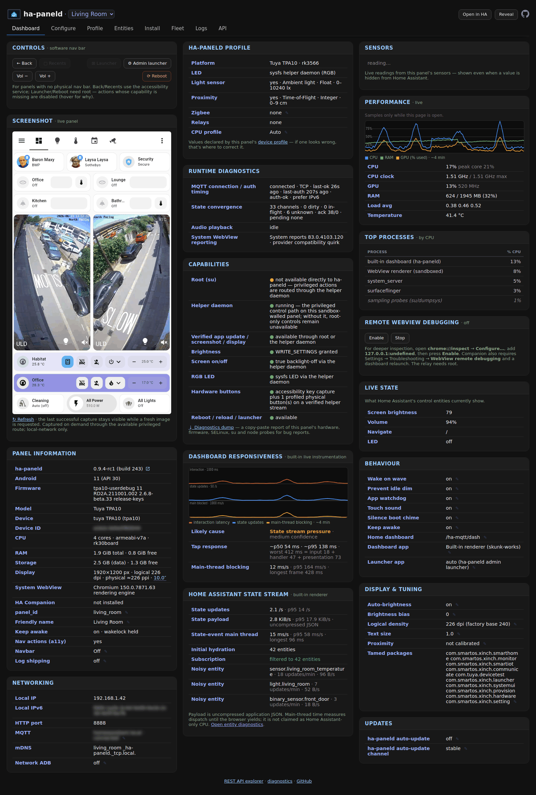
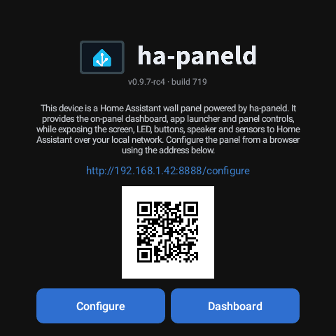
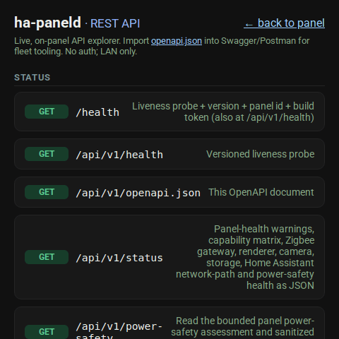

<picture>
  <source media="(prefers-color-scheme: dark)" srcset="app/src/main/res/drawable-night-nodpi/wordmark.png">
  
</picture>

[](https://github.com/maxlyth/ha-paneld/actions/workflows/ci.yml)
[](https://github.com/maxlyth/ha-paneld/releases)
[](LICENSE)

**The universal Home Assistant dashboard app for Android wall panels.**

ha-paneld makes Home Assistant dashboards practical on panels that otherwise feel too slow or awkward to use. Low-powered panels can become sluggish or take seconds to respond when connected to a large Home Assistant installation. One important cause is that the panel receives and processes updates for far more entities than its dashboard displays. ha-paneld's built-in renderer can learn what the dashboard uses and ask Home Assistant to send only those states, reducing the work on the panel without replacing the hardware.

It also replaces fragmented vendor software with one free, open-source way to operate different makes of panel. The Android app exposes the screen, LEDs, buttons, sensors, relays and audio to Home Assistant over HTTP, MQTT auto-discovery and mDNS; adds a built-in launcher and on-screen navigation for key-less hardware; and supports consistent provisioning across a whole fleet. Once provisioned, a panel pairs itself with Home Assistant without per-device YAML.

It is built for panel-class Android, **not** personal phones. Device support is defined through human-readable [runtime panel profiles](docs/profiles/README.md): ha-paneld includes profiles for Sonoff NSPanel Pro, Tuya TPA10, Electron WF1589T, ZHICAI SMT1019, Smatek S9E, the ZX-SMT156/RK3566_T, and the Shelly Wall Display family, while owners and hardware vendors can create, edit, validate, import and share profiles for other panels without rebuilding the app. Use ha-paneld's **built-in renderer** for the integrated dashboard and entity filtering, or the official [HA Companion app](https://github.com/home-assistant/android) when the panel needs Assist voice control or native notifications.

<picture>
  <source media="(prefers-color-scheme: light)" srcset="docs/img/config-ui-light.png">
  
</picture>

**A slow dashboard does not necessarily mean the panel is too weak.** ha-paneld can reduce the stream of Home Assistant state updates before they reach its built-in renderer, while its performance tools show dashboard response time, unexpected reloads, CPU, GPU, clock speed, temperature and the busiest processes. See [docs/performance.md](docs/performance.md) and the [performance comparison](docs/hardware/README.md#performance-comparison--practical-deployment).

## Install

First enable network ADB on the panel (Developer options → "ADB debugging"). Then, from any machine with `adb` on the same LAN, paste:

```sh
curl -fsSL https://raw.githubusercontent.com/maxlyth/ha-paneld/main/scripts/install.sh | bash
```

No checkout, no parameters: it checks your tools (with fix-it hints if `adb`/`curl` are missing), explains each panel change before making it, prompts for the panel IP and a few optional choices, downloads the **latest signed release**, then installs, starts, and verifies ha-paneld. A failed required step exits clearly as incomplete instead of reporting success; correct the named problem and run the same command again. To install the latest **pre-release** (release candidate) instead, append `--prerelease`:

```sh
curl -fsSL https://raw.githubusercontent.com/maxlyth/ha-paneld/main/scripts/install.sh | bash -s -- --prerelease
```

The same one-line installer also supports non-interactive single-panel provisioning. Whole-fleet updates and local builds are covered separately in [Provisioning & fleet updates](docs/provisioning.md).

> [!IMPORTANT]
> **On Windows, run the one-liner in Git Bash or WSL — not PowerShell.** It's a `bash` script, so PowerShell fails at the `bash` step. Git Bash ships with [Git for Windows](https://gitforwindows.org/); install `adb` first with `winget install Google.PlatformTools`, then reopen the shell and paste the command. macOS and Linux run it as-is.

> [!IMPORTANT]
> **First-run gotcha — update the panel's system WebView.** Even modern panels can ship with a WebView/Chromium far too old to render a current Home Assistant dashboard, leaving either the built-in renderer or the HA Companion app blank or broken. See [Updating the system WebView](docs/hardware/README.md#updating-the-system-webview) before judging the panel.

> [!NOTE]
> The built-in renderer is the integrated path for dashboard entity filtering. The [HA Companion app](https://github.com/home-assistant/android) remains supported for panels that need Assist or native notifications; on panels without Google Play, use its [**minimal** release APK](https://github.com/home-assistant/android/releases/latest/download/app-minimal-release.apk).

> [!NOTE]
> ha-paneld can only be sideloaded on a panel — it isn't on the Play Store, so even Play-capable panels (eg 2026 Android 14 models) should sideload it.

### Other ways to install

- **F-Droid (on-device, no PC).** Add ha-paneld's F-Droid repository and install + auto-update straight from the panel — see [Installing via F-Droid](docs/fdroid.md). Easiest where the panel can run F-Droid (Sonoff NSPanel Pro firmware ≥ 4.0.0 bundles it). Delivers the app only — the root-gated features still need [provisioning](docs/provisioning.md).
- **USB bootstrap, no-adb sideload, and scripted / whole-fleet installs** — if your panel doesn't expose adb over the network, or you want to roll many panels at once, see [Provisioning & fleet updates](docs/provisioning.md).

## Why not just the Home Assistant Companion app?

The [HA Companion app](https://github.com/home-assistant/android) targets personal phones and tablets. Wall panels need different primitives: screen, LED and button control; hardware-button events back to Home Assistant; a built-in launcher and on-screen navigation for key-less hardware; fleet provisioning; and automatic pairing. ha-paneld supplies those panel-specific capabilities.

For the dashboard itself there are **two supported paths**. The built-in renderer is designed for a dedicated dashboard panel: it provides entity filtering, remote sign-in without typing on the panel, and recovery from screen-off freezes, connection failures, excessive memory use and renderer crashes. It remains experimental and deliberately omits **Home Assistant's Voice Assistant (Assist)** and native notifications. Use the Companion app when either of those is required. Both paths remain supported.

## Why not Fully Kiosk?

[Fully Kiosk Browser](https://www.fully-kiosk.com/) is a capable general-purpose kiosk browser and a common choice for Home Assistant wall panels. ha-paneld offers a free, open-source stack built specifically for Home Assistant panels: its built-in renderer, entity filtering and panel-hardware controls work together in one app, without a per-device licence.

<details>
<summary>The three friction points in full</summary>

- **Not free, not open source.** Fully Kiosk is closed-source commercial software. The free tier is limited and nags; the parts people actually want for a panel — the remote-admin REST/MQTT API, motion/screensaver controls, no watermark — need the paid **Plus** licence, **per device**. That cuts against HA's and ha-paneld's free, open, local-first ethos.
- **Entity filtering is integrated with the renderer.** ha-paneld can learn which entities its dashboard uses and reduce the state stream before it reaches the panel. A separate browser can still be the better fit when its particular kiosk or screensaver features are required.
- **Per-device config doesn't scale on a non-homogeneous fleet.** Fully Kiosk is configured per device (its settings UI / per-device cloud), so a mixed fleet of different panels drifts and each unit is a bespoke setup. ha-paneld is config-as-code: MQTT auto-discovery, uniform entities across every panel, and one `update-fleet.sh` to roll them together.

If Fully Kiosk's specific extras (e.g. its kiosk lockdown or its particular screensaver) are load-bearing for you, keep using it.
</details>

## Why not FreeKiosk?

[FreeKiosk](https://github.com/RushB-fr/freekiosk) is an unrelated project, despite the similar name. It re-implements Fully Kiosk's feature set on a completely different, fully open-source codebase. One technical difference worth knowing: FreeKiosk is built on React Native, and the second JavaScript runtime it requires can severely impact performance on typical low-RAM panels (1–2 GB).

## Capabilities

| Cap | Surface |
|-----|---------|
| Screen brightness | `light.<panel>_screen` brightness |
| Screen on/off (true backlight off, no lock/PIN) | `light.<panel>_screen` on/off |
| RGB LED | `light.<panel>_led` (per-panel HAL: rk3576 NDK `/dev/ledjni`, or sysfs via the root helper) |
| Hardware-button events | `event.<panel>_button` (a11y key capture) |
| Ambient light / proximity | `sensor.<panel>_illuminance`, learned `binary_sensor.<panel>_proximity` + fleet-normalized `sensor.<panel>_proximity_level` (0 far–100 near) — see [Adaptive proximity and wake on wave](docs/adaptive-proximity.md) |
| Adaptive brightness | Optional seven-day learning from the panel light sensor or one selected Home Assistant illuminance entity — see [Adaptive brightness](docs/adaptive-brightness.md) |
| Launcher / Home Assistant (bring a launcher or the HA dashboard forward) | `button.<panel>_launcher`, `button.<panel>_home` |
| URL navigate | `text.<panel>_navigate` |
| Reload dashboard / reboot | `button.<panel>_reload`, `button.<panel>_reboot` |
| TTS / announce audio | `POST /play` + `number.<panel>_volume` (HA has no MQTT media_player platform) — server-side TTS recipe in [docs/tts.md](docs/tts.md) |
| Panel info + config web page | `GET /` (the device "Visit" link) |

Every panel uses the same MQTT naming and control contracts, while discovery publishes only entities supported by its active profile and live capabilities. Home Assistant still picks them up with no YAML. The full entity reference, the HTTP contract on `:8888`, and how pairing works are in **[docs/api.md](docs/api.md)** (or browse it live at `http://<panel>:8888/api`).

The default **Relaxed mode** keeps that API simple on a trusted home network. Panels on a network shared with less-trusted clients can opt into [Hardened mode](docs/security-mode.md). Hardened mode requires physical access to the panel: high-impact remote actions cannot proceed until someone approves them on the panel's screen, and they cannot be approved remotely. It is enabled locally per panel and is not copied by backup, restore or fleet provisioning.

## What needs root — and what doesn't

A few of ha-paneld's features reach hardware that is only accessible to a privileged process, AKA **root**. Whether a panel permits root access is a property of the **panel's firmware**, not of ha-paneld. For most wall panels this is fine: purpose-built panels such as the Sonoff NSPanel Pro expose `su`, while some others let the installer place ha-paneld's small root helper during ADB setup. The helper has no general shell or filesystem interface. Its one private-app operation is an explicit, descriptor-confined and size-bounded Home Assistant Companion login backup/restore used by the full panel-backup workflow.

Unavailable features remain visible with a 🔒 explanation in the web UI, so a panel never has to pretend that shell access is equivalent to root. If you are not sure which tier a panel supports, the installer and diagnostics report it.

A limited [advanced fallback](docs/shizuku.md) exists for genuinely unrooted panels, but it is not part of the normal supported-hardware path and does not provide root-only hardware features.

**Core features need no root:** Home Assistant pairing, screen brightness and dimming, audio announcements/TTS, both dashboard renderers (HA Companion and the built-in renderer), the web UI and REST API, and configuration backup/restore. MQTT discovery publishes only the sensors and controls supported by the active profile and live capability probes. Back/Recents, wake on wave and the soft navigation bar also depend on the panel having the required Android sensor, Accessibility or overlay capability.

**Still needs direct root (`su`) or ha-paneld's root helper:** true screen-off (backlight hard-off), RGB LED and relay control where the hardware requires it, vendor-app taming, reboot and CPU governor.

**Still needs direct root (`su`) inside ha-paneld:** kiosk lock, full system logs, and borrowing the Companion's sign-in when switching renderers. Full backups can include and restore the Companion login through either direct root or the current authenticated root helper.

## Supported hardware

ha-paneld needs no system-signed install. Standard-Android capabilities (brightness, sleep, navigate, TTS) work on any panel; LED/buttons depend on a per-panel hardware abstraction layer (HAL) or direct support in ha-paneld via a profile.

| Panel class | SoC | Android | ABI | Notes |
|-------------|-----|---------|-----|-------|
| Sonoff NSPanel Pro / Pro 120 | Rockchip PX30 / rk3326-S | 8.1 (API 27) | arm64-v8a | toolbox `su` |
| Tuya TPA10 | Rockchip rk3566 | 11 (API 30) | armeabi-v7a | 32-bit userspace |
| Electron WF1589T | Rockchip rk3576 | userdebug (`adb root`) | arm64-v8a | RGB LED via clean-room NDK ioctl on `/dev/ledjni` (no vendor lib) |
| ZHICAI SMT1019 | Rockchip rk3576 | 14 (API 34) | arm64-v8a | no root; RGB LED firmware-locked (ioctl denied) — community-reported ([#8](https://github.com/maxlyth/ha-paneld/issues/8)) |
| ZX-SMT156 / RK3566_T | Rockchip rk3566 | 13 (API 33) | arm64-v8a | **preliminary OEM/generic-market wall panel** — app-direct RGB LED and light/proximity; climate is optional enhanced capability, while relay and root/unlock paths remain under characterisation ([#24](https://github.com/maxlyth/ha-paneld/issues/24)) |
| Smatek S9E | Rockchip rk3566 | 11 (API 30) | arm64-v8a | onboard relays + button LEDs; proximity via root GPIO (not SensorManager) |
| Shelly Wall Display — Stargate / Atlantis / Pegasus | MediaTek MT6580 | 7.0 (API 24) | armeabi-v7a | **research-only profile** — no confirmed ha-paneld installation path; relay via HA Shelly integration (not sysfs) |
| Shelly Wall Display — Blake XL / Jenna / Cally / Maverick / Dayna | Arm64 (Jenna confirmed PX30; other SoCs TBC) | 11 (API 30) | arm64-v8a | **research-only profile** — no confirmed ha-paneld installation path; Shelly's AppStore does not currently establish ha-paneld availability |

## Status & roadmap

**Latest stable release — 0.9.4:** built-in dashboard diagnostics now break interaction delay into input, handler and presentation time, correlate it with Home Assistant state traffic, main-thread blocking and renderer instability, retain seven days of content-free history, and report a conservative likely cause. The one-line installer also starts the app during setup so it can identify the active hardware profile and verify the panel-specific requirements in the same installation pass. Full notes are in [CHANGELOG.md](CHANGELOG.md).

**Release candidate — 0.9.5-rc1 (under test):** adaptive brightness and proximity learn each panel's room and sensor behaviour, optional Hardened mode requires someone physically at the panel to approve selected high-impact remote actions on its screen, and lifecycle fixes improve recovery after configuration, network and helper changes. These actions cannot be approved remotely. This label describes the current candidate in source; it is not a published release until the matching GitHub prerelease exists.

**Where it's heading** — the near-term direction remains reliable provisioning and operation across more than one panel. Two larger stretch candidates are being evaluated for the initial v1.0 release: fleet management and Voice Assistant support; neither is committed. Other planned work includes MQTT TLS for self-signed brokers, an on-device scheduler, deeper per-card performance attribution, and continued iteration on the HTTP UI. The full curated list is in **[docs/roadmap.md](docs/roadmap.md)**.

## Documentation

- **[docs/api.md](docs/api.md)** — the control API: uniform MQTT entities, the HTTP contract (`:8888`), and pairing. Browse and try every endpoint live at `http://<panel>:8888/api`; the machine-readable spec is at `/openapi.json`.
- **[docs/security-mode.md](docs/security-mode.md)** — Relaxed and Hardened modes, protected actions requiring physical approval at the panel that cannot be given remotely, and the exact network retry contract.
- **[docs/profiles/](docs/profiles/)** — create, validate, test and exchange human-readable panel profiles at runtime, without Android Studio or a source build.
- **[docs/provisioning.md](docs/provisioning.md)** — unattended provisioning, whole-fleet updates, adb bootstrap, and the permission grants.
- **[docs/built-in-renderer.md](docs/built-in-renderer.md)** — the built-in dashboard renderer (experimental): what it is, turning it on (incl. the one-click Companion sign-in borrow), theming, and what it deliberately omits.
- **[docs/adaptive-brightness.md](docs/adaptive-brightness.md)** — choose an ambient-light source, understand learning and temporary manual preferences, and reset the seven-day history when a panel moves.
- **[docs/adaptive-proximity.md](docs/adaptive-proximity.md)** — automatic proximity learning, the guided wave journey, normalized Home Assistant entities and wake-on-wave behavior.
- **[docs/building.md](docs/building.md)** — build from source (Docker or local toolchain) and the signing notes forkers need. See also [docs/local-builds.md](docs/local-builds.md) (devcontainer).
- **[docs/roadmap.md](docs/roadmap.md)** — the full planned + stretch roadmap (shipped work is in [CHANGELOG.md](CHANGELOG.md)).
- **[docs/hardware/](docs/hardware/)** — reverse-engineered hardware references for the supported panels (SoC, LED control path, sensors, radios), since these devices are otherwise undocumented: [NSPanel Pro](docs/hardware/nspanel-pro.md) (PX30), [TPA10](docs/hardware/tpa10.md) (rk3566), [WF1589T](docs/hardware/wf1589t.md) (rk3576), [SMT1019](docs/hardware/smt1019.md) (rk3576, community), [Smatek S9E](docs/hardware/s9e.md) (rk3566), [ZX-SMT156](docs/hardware/zx-smt156.md), and [Shelly Wall Display](docs/hardware/shelly-wall-display.md) (preliminary) — plus a [performance comparison](docs/hardware/README.md#performance-comparison--practical-deployment).
- **[docs/tts.md](docs/tts.md)** — server-side TTS recipe: render a phrase with any HA engine (Piper, Cloud) and send it to a panel via a small script (no add-on, no on-device TTS).
- **[docs/performance.md](docs/performance.md)** — why a Home Assistant dashboard can overwhelm a low-powered panel, how to measure the problem, and how to reduce the work reaching the renderer.
- **[docs/display-sizing.md](docs/display-sizing.md)** *(experimental / R&D)* — matching dashboard size to a desktop browser via display density + system font scale (Android panels often ship these mismatched to the physical screen).
- **[helper/README.md](helper/README.md)** — the root LED/control helper daemon for sysfs-LED panels (build + boot-persistent install).
- **`GET /diag`** on a panel — a copy-paste hardware/firmware/capability dump for bug reports.

## Screenshots

| ha-paneld standing screen | REST API explorer |
|---|---|
|  | <picture><source media="(prefers-color-scheme: light)" srcset="docs/img/api-explorer-light.png"></picture> |

## Stack

- **Application runtime** — [Kotlin](https://github.com/JetBrains/kotlin), [AndroidX](https://github.com/androidx/androidx) and [kotlinx.coroutines](https://github.com/Kotlin/kotlinx.coroutines).
- **HTTP and Home Assistant WebSocket** — [Ktor](https://github.com/ktorio/ktor) CIO server, client and WebSocket modules provide coroutine I/O without a thread per connection.
- **MQTT** — [HiveMQ MQTT Client](https://github.com/hivemq/hivemq-mqtt-client) supplies the MQTT 5 client and pure-Java NIO transport, keeping the APK ABI-agnostic.
- **mDNS** — [JmDNS](https://github.com/jmdns/jmdns) advertises `_ha-paneld._tcp` with reliable TXT records across supported Android API levels.
- **Runtime profiles** — [SnakeYAML Engine](https://github.com/snakeyaml/snakeyaml-engine) parses YAML 1.2 profile documents, while [CodeMirror](https://codemirror.net/) and its [YAML language package](https://github.com/codemirror/lang-yaml) provide the in-browser profile editor.
- **QR and logging** — [ZXing](https://github.com/zxing/zxing) generates on-panel setup QR codes, while [SLF4J](https://github.com/qos-ch/slf4j) routes Ktor and HiveMQ logs to Logcat.

Dependency selection and updates follow the project's [dependency and supply-chain policy](SECURITY.md#dependency-and-supply-chain-policy).

## Want your panel supported?

ha-paneld has no donate button. It's free, and the "payment" that actually moves it forward is **more panels supported** — which takes hardware to study. Start with the [runtime profile authoring guide](docs/profiles/README.md): Generic can produce a passive draft that you can validate, test and share without building the app. Fully curated support still needs hands-on evidence from the device itself, especially for buttons, LEDs, relays and sensors.

So if you'd like to help:

- **Create and share a profile.** Open `http://<panel-ip>:8888/profiles`, download the Generic device draft, and follow the staged [testing](docs/profiles/testing.md) and [sharing](docs/profiles/sharing.md) guides. A community profile can be useful before it is ready to ship as a bundled profile.
- **Or open an issue with your panel's diagnostics.** Visit `http://<panel-ip>:8888/diag` (or the diag link on the panel's config page) and paste the redacted dump into a new issue. That's enough to start; from there we'll work out a short interactive workflow to map the buttons/LEDs/sensors that need a person at the panel.
- **Or send me the panel.** I'm **UK-based** and happy to do the reverse-engineering directly — the fastest route to a fully-supported new model. You'll get it back (I have way too many already); open an issue first so we can sort the details.

The result is always open: your panel becomes a profile everyone can use — a bit less per-vendor fragmentation for the next person. That's the donation.

## Acknowledgements

Thanks to **Seaky** for [**NSPanel Pro Tools**](https://github.com/seaky/nspanel_pro_tools_apk) ([releases](https://github.com/seaky/nspanel_pro_tools_apk/releases)), which showed what good panel-side Home Assistant tooling can do — genuinely excellent work. It targets the Sonoff NSPanel-Pro class and is distributed as a closed-source APK; ha-paneld exists to be an **open, multi-vendor** alternative that any Android panel can adopt and extend.

## Licence

Apache-2.0. See [LICENSE](LICENSE).
