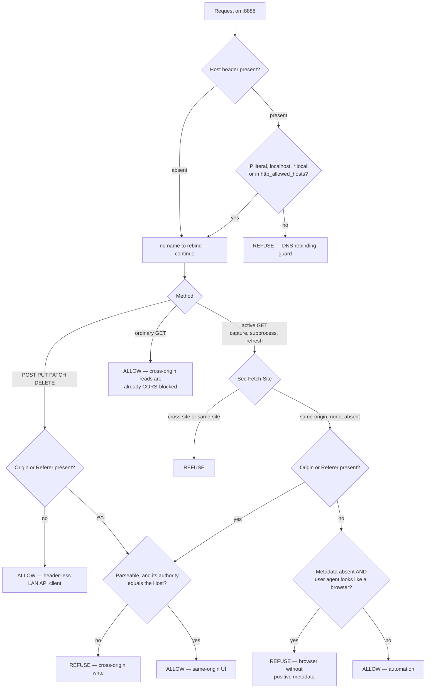

# Security posture

ha-paneld runs a foreground agent on a wall panel exposing an HTTP API (`:8888`), an MQTT control plane, a root helper daemon, and an opt-in CDP/DevTools relay. **Relaxed mode retains the turnkey LAN-trust, no-token pairing UX by default.** Optional [Hardened mode](../security-mode.md) requires physical access for selected high-impact network operations: someone must approve them on the panel's screen, and they cannot be approved remotely. The remaining unauthenticated API is still an accepted residual risk, with network segmentation and a future Home Assistant authentication path as the broader controls. This note records the threat model and the decisions taken.

## Trust model

The panel and Home Assistant normally sit on a **trusted LAN**, and the app is built around a **turnkey, no-token pairing UX**. A root/file-level attacker on the panel itself is out of scope (they already own the device). Software already running on the panel is also trusted for the Hardened-mode boundary because loopback requests cannot be attributed securely to the ha-paneld UI rather than another local Android app. Hardened mode is an opt-in physical-presence boundary for networks where not every remote client should be allowed to perform destructive or credential-bearing operations; it is not a complete authentication layer.

> [!WARNING]
> The notable **accepted residual risk**: a LAN-local actor without credentials can still reach unauthenticated `:8888` routes. Hardened mode protects the high-impact operations listed in the [user guide](../security-mode.md#protected-operations), but does not authenticate every read or routine control. Restricting reach remains delegated to network segmentation ([decision 2](#decisions)), with Home Assistant authentication ([decision 3](#decisions)) as the future general-auth path.

## Attack surface

| Surface | Exposure | Notes |
| --- | --- | --- |
| **HTTP API `:8888`** | unauthenticated; binds dual-stack (`::`) | Relaxed mode trusts LAN callers; Hardened mode adds physical approval to selected high-impact routes |
| **Runtime profile import/activation** | trusted-LAN HTTP workflow; activation is approval-gated in Hardened mode | untrusted YAML is previewed, validated, stored as immutable revisions and explicitly activated; it can select only compiled drivers and cannot grant authority |
| **CDP / WebView DevTools relay `:9222`** | opt-in in Relaxed mode (started via `/inspect/start`), binds `0.0.0.0`, unauthenticated | full dashboard-session access if started; Hardened mode stops and verifies the process and listener before activation, then prevents restart |
| **MQTT** | governed by the broker | the intended control plane; inherent to MQTT discovery |
| **Camera RTSP `:8554`** | off by default; while the camera setting is on it binds every interface and serves the video-only stream unauthenticated | enabling it from Home Assistant needs approval at the panel in every mode, and the camera cannot open unless the on-screen indicator can be drawn; treat the stream as LAN-visible for as long as it is on |
| **Root helper daemon** (abstract UNIX socket `@hapaneld-helper`) | mutually peer-uid authenticated (`SO_PEERCRED`: server must be root; client must be the current ha-paneld uid or root), command-whitelisted, char-sanitised, bounded parsing, conn caps | Sound — was unauthenticated loopback TCP `:8889`; the app rejects a non-root process that claims the abstract name, and generic Android shell uid is excluded so Shizuku's shell-only boundary cannot become root. Its only private-app operation is an explicit Companion login backup/restore confined to an allowlisted package and fixed descriptor-relative files, with size bounds, staged validation and a recovery journal. |
| **[Shizuku enhanced access](../provisioning.md#shizuku-fallback-for-unrooted-panels)** | optional; enabled and approved only on the panel | Official manager signer is pinned; the UserService must report UID 2000 and protocol v2; methods and inputs are typed and bounded, with no generic command or filesystem access. Shell is not root. Consent is excluded from Android backup, config bundles, restore, and fleet push. ADB-started service may need rearming after reboot. |
| **Network ADB** | opt-in switch; opens `5555` to the LAN when enabled; Android may separately expose paired Wireless debugging on a dynamic TLS port | documented and off by default; classic TCP ADB and Android Wireless debugging are mutually exclusive with Hardened mode because an ADB client could inject input into the approval screen |
| **Accessibility service** | key-capture only (no window-content retrieval) | Sound |
| **su call-sites** | CPU governor regex-sanitised; relay/adb/cdp use constants; Zigbee role now allowlisted | the Zigbee role was the one un-validated interpolation; no remaining injection paths |

The state-changing routes on `:8888` are where the exposure concentrates:

- `POST /config` — sets MQTT broker + credentials + panel id. In Hardened mode a changed broker or Home Assistant origin cannot inherit the credential stored for the previous endpoint: a replacement credential must arrive in the same save or the old one is cleared. Repointing remains a denial-of-service risk because routine configuration is not generally approval-gated.
- `POST /play` — downloads + plays an arbitrary HTTP(S) URL; HTTPS uses the platform trust store and normal hostname verification, while cleartext HTTP remains available for LAN sources. Remote media requests require physical approval in Hardened mode.
- `POST /api/v1/inspect/start` — starts the CDP relay (the `:9222` surface above) in Relaxed mode; Hardened mode closes and disables this surface rather than approving it.
- Profile save/activate/rollback routes — can change which compiled hardware drivers and capability candidates the panel uses after a controlled service restart. Preview tokens bind save to the exact inspected YAML, activation pins an exact revision/hash, risky declarations are highlighted, and startup falls back to the last-known-good revision. Activation and rollback require physical approval in Hardened mode.
- `GET /diag` — device/capability info (recon). Intentionally a support tool (issue template).
- `GET /api/v1/screenshot.png` and `POST /api/v1/input` — view and inject input on the panel. Root/helper routes already expose these; locally approved Shizuku makes the same trusted-LAN controls available on a non-root panel. Hardened mode keeps screenshots available but rejects non-loopback input so a remote caller cannot operate the native approval UI.
- `POST /api/v1/install/component` — can install signer-pinned ha-paneld or minimal Companion builds. Shizuku enables those verified updates on a non-root panel, but does not enable arbitrary APK upload or WebView replacement. Component installation and an inspected uploaded APK's commit are protected by Hardened mode.
- Full backup export and restore routes — can carry configuration secrets and, when explicitly selected on a rooted/helper-backed panel, the allowlisted Home Assistant Companion login files. Hardened mode approval protects network export and restore; encrypted `.hpb` archives remain the recommended portable format. The helper has no general private-filesystem command and the Companion transfer is descriptor-confined, size-bounded and transactionally restored.

### Provisioning credentials

Host-side provisioning accepts MQTT passwords, Home Assistant long-lived tokens and Home Assistant login passwords through `--mqtt-pass-file`, `--ha-token-file` and `--ha-pass-file`. The one-line installer rewrites the older literal-value flags to private temporary files before it starts the authenticated provisioner, preventing an avoidable second copy in the child command line. It cannot portably erase the literal from the user's original shell history or installer process, so public instructions use the file options and retain literal flags only for compatibility. Secret values are not exported through the helper installer: adb, su and the root transaction journals carry only authenticated artifact hashes, build identities, nonces and staging paths.

Credential files address exposure on the provisioning host, not transport confidentiality. The management endpoint remains cleartext `http://<panel>:8888` under the trusted-LAN model. The Home Assistant password is submitted directly from the host to the configured HA login endpoint and never reaches the panel; an `http://` HA URL sends it without transport encryption, so credential login should use HTTPS. Supplied or newly minted access/refresh tokens, the MQTT password, secret config export and config restore cross the host-to-panel management connection without TLS. Hardened mode can require physical approval for protected requests; it does not encrypt them. Operators must keep provisioning and the management API on a trusted, segmented network.

**Browser-mediated attacks are guarded** ([`OriginGuard`](../../app/src/main/kotlin/io/github/maxlyth/hapaneld/http/OriginGuard.kt)):
- **CSRF** — OriginGuard refuses a state-changing request (`POST`/`PUT`/`PATCH`/`DELETE`) whose `Origin`/`Referer` is present and doesn't match the request `Host`, so a malicious LAN web page can't silently drive these endpoints. Same-origin UI `fetch`es and header-less API clients (curl / HA `rest_command`) are unaffected.
- **DNS-rebinding** — the `Host` header must be an IP literal, `localhost`, `*.local` (mDNS), or an operator-configured name (`http_allowed_hosts`); any other hostname is refused (all methods), so an attacker who rebinds their own DNS name to the panel can't pose as same-origin to read secrets (`GET /config/export`) or drive the surface. Reaching a panel by IP — the norm — is always allowed and is inherently rebinding-immune.

Every request passes the rebinding check first; what happens next depends on whether it changes state, starts privileged work, or is an ordinary read:

Three behaviours there are easy to misread from the prose. A **missing `Host` passes** the rebinding check, because there is no name to rebind — but a **state-changing request with no `Host` is refused**, as is one whose `Origin` is present but unparseable. Ordinary `GET`s are deliberately not origin-guarded, since the browser's same-origin policy already blocks reading the response; it is the *side effect* of a write, or of an active read, that needs guarding. And active `GET`s — those that start capture, a subprocess, sampling or a network refresh — take a third path keyed on Fetch Metadata, failing closed for a browser-shaped request that supplies no positive same-origin evidence while leaving header-less automation working.

Neither authenticates the *caller*. Hardened mode can require physical approval for a protected operation, but decision 3 remains the upgrade path for general caller authentication.

Runtime profile files are treated as untrusted data, not plugins. The closed schema can select only drivers compiled into ha-paneld; it carries no shell commands, helper verbs, native code or general scripting. Privileged paths are restricted to core allowlists, and WebView recommendations select only core-owned artifact IDs whose HTTPS URL, version and signer hash are compiled into the app. Security-sensitive driver parameters are validated by the owning driver, and declarations never substitute for live root/helper/Shizuku or hardware probes. A Shizuku recommendation cannot install the Manager, record local consent or approve ha-paneld.

## Decisions

1. **No bespoke API token.** A per-panel secret is throwaway and breaks the easy UX. (Rejected.)
2. **No in-app network allowlist.** Restricting *who* can reach `:8888` is delegated to the network/infrastructure layer (router / VLAN / firewall segmentation) rather than reinvented in the app — consistent with leaning on existing platform/infra capabilities. The in-app upgrade path, when warranted, is the HA-auth model (decision 3).[^ha-ipban]
3. **Future auth: integrate with HA's auth model**, not a custom scheme. When real auth is warranted, require `Authorization: Bearer <token>` on state-changing endpoints and **validate the token against the configured HA instance** (cached `GET /api/`). This reuses HA's token lifecycle (issue/revoke in the HA UI), works with HA `rest_command` bearer headers, and **maps directly onto a future custom integration** (which would authenticate via HA natively) — so it survives a possible MQTT→custom migration instead of being discarded.
4. **Credential-at-rest encryption descoped.** MQTT creds live in app SharedPreferences; encrypting them only defends against a root/file attacker who already owns the device, at the cost of a deprecated `security-crypto` dependency and a credential migration across deployed panels; low value for the cost.
5. **`/play` keeps standard HTTPS verification while allowing cleartext HTTP** for LAN audio sources under the LAN-trust model; revisit cleartext support if HA-auth (decision 3) lands.
6. **Hardened mode is opt-in and device-local.** Relaxed mode remains the default so existing Home Assistant and fleet workflows do not acquire unattended prompts. Hardened approval is process-local, bound to the HTTP peer or shared MQTT command channel and the exact protected request, valid for ten minutes and consumed by one matching retry. It cannot be enabled by a network request, backup, restore or fleet operation, and it cannot coexist with classic TCP ADB, persistent or explicitly addressed ADB listeners, Android Wireless debugging, or the LAN WebView developer-tools relay. Entry fails closed unless those remote-control paths are verified inactive. Non-loopback tap injection is unavailable while it is active. Loopback software already running on the panel remains trusted.

## Done

- Zigbee `setRole()` allowlists the role before shell interpolation (no arbitrary-string injection).
- **Cross-origin (CSRF) guard** on state-changing `:8888` routes ([`OriginGuard.allowed`](../../app/src/main/kotlin/io/github/maxlyth/hapaneld/http/OriginGuard.kt)) — refuses a browser write whose `Origin`/`Referer` doesn't match the request `Host`; API clients (no `Origin`) and same-origin UI unaffected.
- **DNS-rebinding guard** ([`OriginGuard.hostAllowed`](../../app/src/main/kotlin/io/github/maxlyth/hapaneld/http/OriginGuard.kt)) — pins the `Host` header to IP literals / `localhost` / `*.local` / configured names (`http_allowed_hosts`); other hostnames refused, so a rebound name can't masquerade as same-origin.
- **APK-installer downloads are HTTPS-only** ([`AppInstaller`](../../app/src/main/kotlin/io/github/maxlyth/hapaneld/util/AppInstaller.kt)) — the initial URL and every redirect hop must be `https` (defence-in-depth on top of the post-download signer/package pin, which already blocks installing a substituted APK).
- **Optional physical approval for high-impact network controls** — [Hardened mode](../security-mode.md) covers credential-bearing export/restore, software and package mutation including a download bound to one exact URL, profile activation, reboot, display and renderer maintenance, database recovery maintenance, and remote media while leaving Relaxed mode as the default. Enabling the panel camera is approved in every mode rather than only in Hardened. Remote tap injection, network ADB and LAN WebView developer tools are unavailable because any of them could operate the approval UI; entry verifies those surfaces are closed before the mode change is saved.

[^ha-ipban]: HA's own IP allowlist / `ip_ban` secures HA's HTTP server, **not** the panel's separate `:8888`, so it doesn't apply directly; network segmentation is the "use what exists" control here.

> [!NOTE]
> For how the device-specific su call-sites and helper-daemon paths are organised per platform, see the [device-profile architecture](device-profiles.md).
